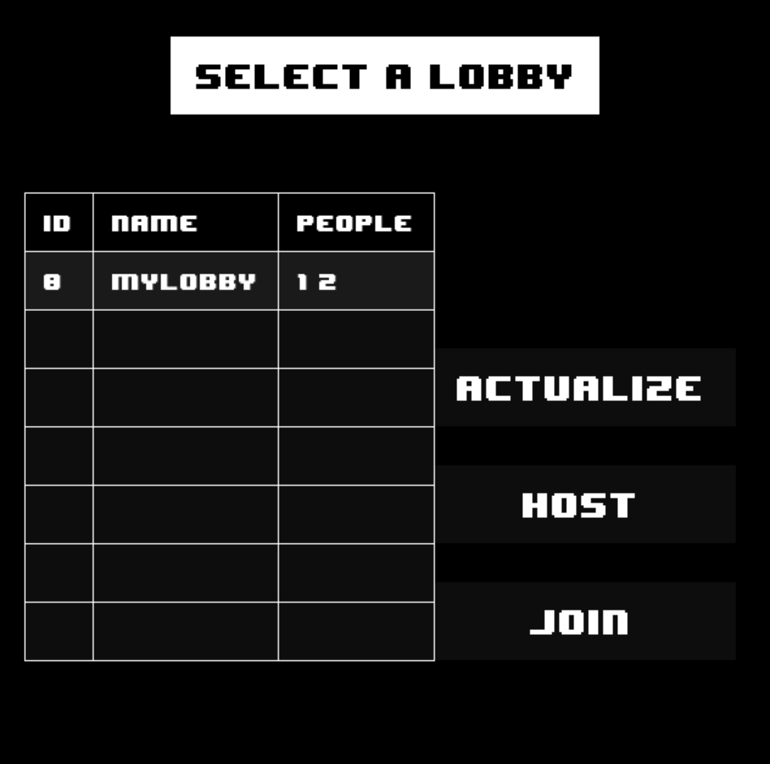

# Multiplayer Snake

This project was created to improve my skills and deepen my understanding of networking.  
It is a multiplayer Snake game in Python, using only the native `socket` library for networking.  
The client uses `pygame` to render the game screen.  


## Prerequisites

- Python 3.8+
- `pygame` (client only)

## Installation

Clone the repo :
```bash
git  clone https://github.com/Allu-mette/Snake.git
cd Snake
```

### Server

No dependencies are required. You can directly run the server :
```bash
cd server
python run.py
```

### Client

It is recommended to use a virtual environment to install `pygame` :
```bash
cd ./client
python -m venv env

# Windows
./env/Script/activate

# Linux
source ./env/bin/activate

pip install pygame
```
Then run the client : 
```bash
python run.py
```

## Screenshots




## Customize
There is no configuration file yet.   
If you want to change the server host and port, you must edit the following files :

- In `./server/run.py` :
```python
server_ip = "IP"
port = PORT
```

- In `./client/network.py` :
```python
self.addressIp = "IP"
self.port = PORT
```